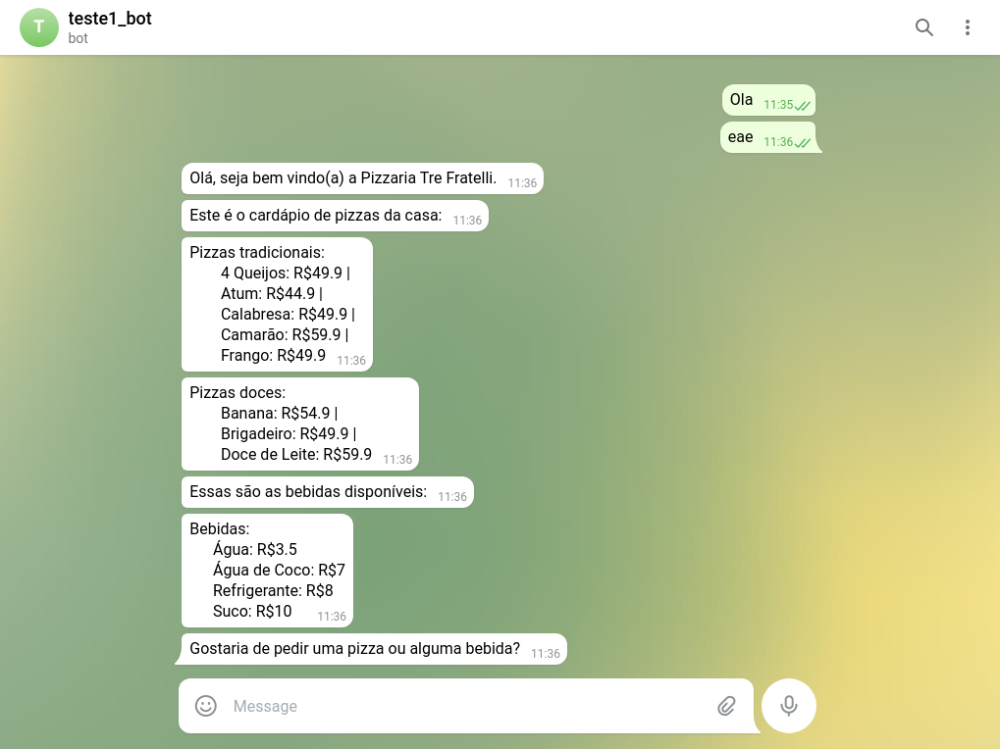

# Chatbot Tre Fratelli

## On the road

  Estou bem insatisfeito com o que eu fiz. Essa foi a avaliação que eu mais tive dificuldade, por uma série de motivos. Primeira vez implementando algo do gênero, gastei muito tempo pensando em alternativas, estimei mal o tempo para a realização da avaliação, visto que nunca tinha feito algo desse tamanho antes. Também tentei modular o código, entretanto quebrou o código e já não existia tempo para solucionar os erros. Não quero de forma nenhuma justificar o meu desempenho, desejo apenas informar o aconteceu. 
  Diante disso, irei levar essa experiência como aprendizado para as próximas atividades e buscar melhorar meu pontos fracos que essa atividade revelou. 


## Sobre o bot
  A aplicação dá boas vindas para o usuário e também exibe os produtos com os preços. O usuário pode escolher o que deseja entre pizza e bebida. 
  
<ul>
  <li>Express - para criar o servidor e e criar as rotas.</li>
  <li>actions-on-google - para auxiliar no tratamento das respostas</li>
  <li>dialogflow-fulfillment - realizar a análise do corpo das solicitações.</li>
  
</ul>

## Execução  

  Primeiramente é necessário que o Node.JS e o Ngrok esteja instalado na máquina. 
  
  Clone este repositório e no mesmo diretório instale as depenêcias pelo terminal:

  ```node
  npm i express dialogflow-fulfillment actions-on-google
  ```
  Após a instalação dos pacotes, ainda no terminal, digite
  ```
  npm start
  ```
  O terminal vai informar que a aplicação está funcionando na porta 3000, basta acessar no seu navagador preferido: 
```
localhost:3003
  ```
  Após ter feito o passo anterior, abra o terminal na pasta onde se encontra o ngrok e digite
```
./ngrok http 3003
  ```
 Copie o primeiro endereço "forwarding"gerado no webhook dentro do fulfillmet do bot no DialogFlow.
  
O Bot também está no telegram: https://t.me/teste1_bot ou busque dentro do telegram pelo @teste1_bot

